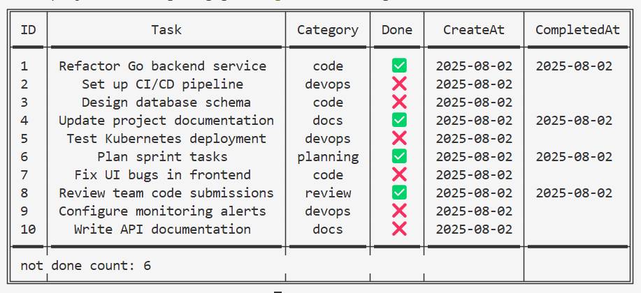

<p>
  
</p>

# Go CLI Todo App
This is a simple command-line todo application written in Go. It allows you to create, read, update, and delete tasks into/from a local JSON file.

## Installation
To install the application, you will need to have Go installed on your system. Once you have installed Go, you can download and install the application using the following command:

## Usage
Be sure to run `gtodo init` to generate an empty JSON file in your home directory to store todo tasks.

To use the application, simply run the `gtodo` command followed by one of the following subcommands:

- `add`: Add a new task.
- `list`: List all tasks.
- `update`: Update the details of an existing task.
- `delete`: Delete a task.

Each subcommand has its own set of options and arguments. Here are some examples of how to use the application:

```bash
# Add a new task
gtodo add -task "learn-go" -cat "code"

# List all tasks
gtodo list
gtodo list -done 1 # list tasks that are completed
gtodo list -done 1 -cat "code" # list tasks that are completed and belong to category "Project"

# Update an existing task
gtodo update -id 1 -task "learn-py"
gtodo update -id 1 -cat "ai"

# Delete a task
gtodo delete -id 1
gtodo delete -done 0
```